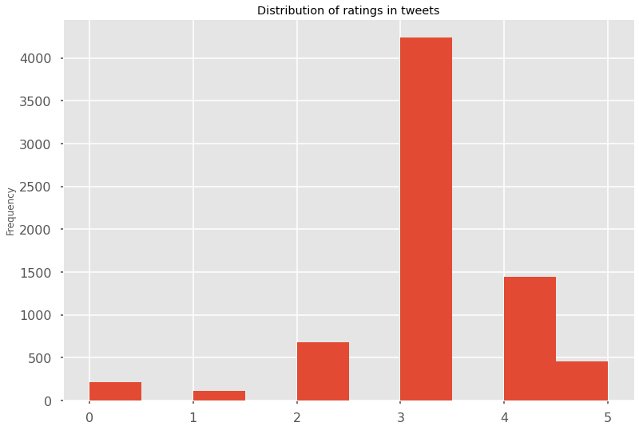
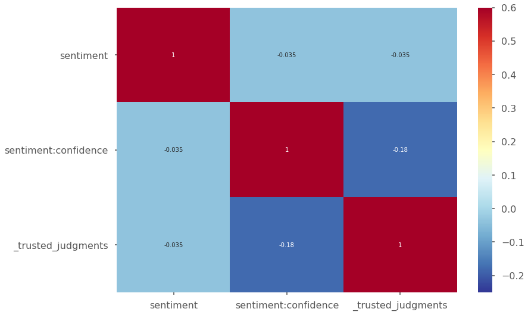

##Exploratory data analysis


```python
import numpy as np
import pandas as pd 
from sklearn.preprocessing import LabelEncoder
import os 
import warnings
warnings.filterwarnings('ignore')
import matplotlib.pyplot as plt
import seaborn as sns
import matplotlib.style as style
```


```python
cols = ['_unit_id', '_golden', '_unit_state', '_trusted_judgments', '_last_judgment_at',
                'sentiment', 'sentiment:confidence', 'our_id', 'sentiment_gold', 'reason', 'text']
data = pd.read_csv("Twitter-sentiment-self-drive-DFE.csv",header=None, names=cols,encoding ="ISO-8859-1")
data = data.iloc[1:]
data.head()
```


<div>
<style scoped>
    .dataframe tbody tr th:only-of-type {
        vertical-align: middle;
    }

    .dataframe tbody tr th {
        vertical-align: top;
    }

    .dataframe thead th {
        text-align: right;
    }
</style>
<table border="1" class="dataframe">
  <thead>
    <tr style="text-align: right;">
      <th></th>
      <th>_unit_id</th>
      <th>_golden</th>
      <th>_unit_state</th>
      <th>_trusted_judgments</th>
      <th>_last_judgment_at</th>
      <th>sentiment</th>
      <th>sentiment:confidence</th>
      <th>our_id</th>
      <th>sentiment_gold</th>
      <th>reason</th>
      <th>text</th>
    </tr>
  </thead>
  <tbody>
    <tr>
      <th>1</th>
      <td>724227031</td>
      <td>TRUE</td>
      <td>golden</td>
      <td>236</td>
      <td>NaN</td>
      <td>5</td>
      <td>0.7579</td>
      <td>10001</td>
      <td>5\n4</td>
      <td>Author is excited about the development of the...</td>
      <td>Two places I'd invest all my money if I could:...</td>
    </tr>
    <tr>
      <th>2</th>
      <td>724227032</td>
      <td>TRUE</td>
      <td>golden</td>
      <td>231</td>
      <td>NaN</td>
      <td>5</td>
      <td>0.8775</td>
      <td>10002</td>
      <td>5\n4</td>
      <td>Author is excited that driverless cars will be...</td>
      <td>Awesome! Google driverless cars will help the ...</td>
    </tr>
    <tr>
      <th>3</th>
      <td>724227033</td>
      <td>TRUE</td>
      <td>golden</td>
      <td>233</td>
      <td>NaN</td>
      <td>2</td>
      <td>0.6805</td>
      <td>10003</td>
      <td>2\n1</td>
      <td>The author is skeptical of the safety and reli...</td>
      <td>If Google maps can't keep up with road constru...</td>
    </tr>
    <tr>
      <th>4</th>
      <td>724227034</td>
      <td>TRUE</td>
      <td>golden</td>
      <td>240</td>
      <td>NaN</td>
      <td>2</td>
      <td>0.882</td>
      <td>10004</td>
      <td>2\n1</td>
      <td>The author is skeptical of the project's value.</td>
      <td>Autonomous cars seem way overhyped given the t...</td>
    </tr>
    <tr>
      <th>5</th>
      <td>724227035</td>
      <td>TRUE</td>
      <td>golden</td>
      <td>240</td>
      <td>NaN</td>
      <td>3</td>
      <td>1</td>
      <td>10005</td>
      <td>3</td>
      <td>Author is making an observation without expres...</td>
      <td>Just saw Google self-driving car on I-34. It w...</td>
    </tr>
  </tbody>
</table>
</div>


As we can see, there are 11 columns in the given dataset:
    1)'_unit_id'
    2)'_golden'
    3)'_unit_state'
    4)'_trusted_judgments'
    5)'_last_judgment_at'
    6)'sentiment'
    7)'sentiment:confidence'
    8)'our_id'
    9)'sentiment_gold'
    10)'reason'
    11)'text'

For my sentiment analysis, I will only consider  'sentiment' and 'text' as being relevant. For future improvements, the confidence can also be incorporated. 


```python
style.use('seaborn-poster') 
style.use('ggplot')
data= app_train.drop(data.index[0])
data['sentiment'] = data['sentiment'].replace('not_relevant',0)
data['sentiment'] = data['sentiment'].astype(float)
data['sentiment:confidence'] = data['sentiment:confidence'].astype(float)
data['_trusted_judgments'] = data['_trusted_judgments'].astype(float)
data['sentiment'].plot.hist(title = 'Distribution of ratings in tweets');
```





We can evidently see that the distribution is not even and most of the reviews are concentrated under the rating '3' - which I will take as being positive. The '0' bucket contains reviews that can not be classified as either group. 


```python
corr = data[['sentiment','sentiment:confidence','_trusted_judgments']].corr()
sns.heatmap(corr,cmap = plt.cm.RdYlBu_r, vmin = -0.25, annot = True, vmax = 0.6)
```


    <matplotlib.axes._subplots.AxesSubplot at 0x13914e56488>





From the above graph we can notice there is almost no correlation between the number of trusted judgements, our confidence in the given judgement and the classfied sentiment. So I will safely omit the confidence level and the number of trusted judgements in my further classification.
